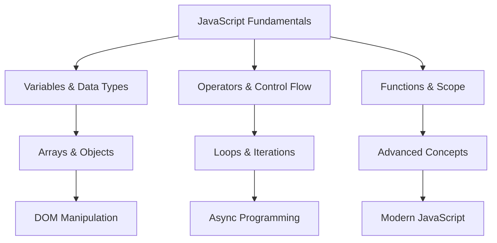
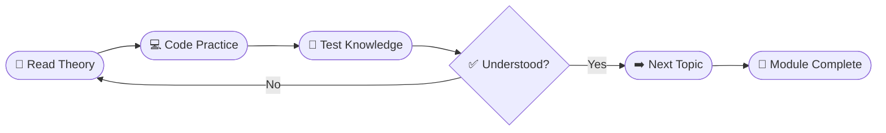
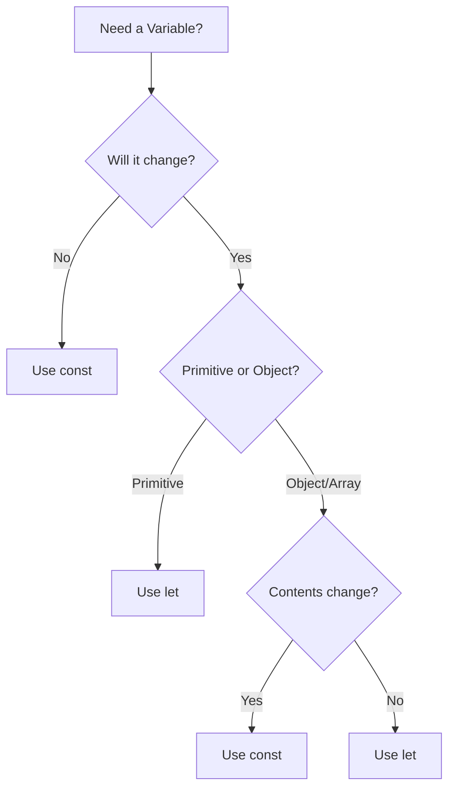
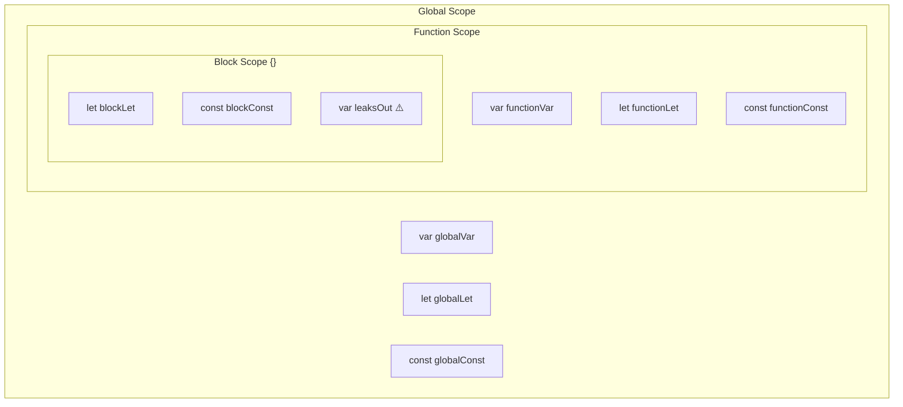
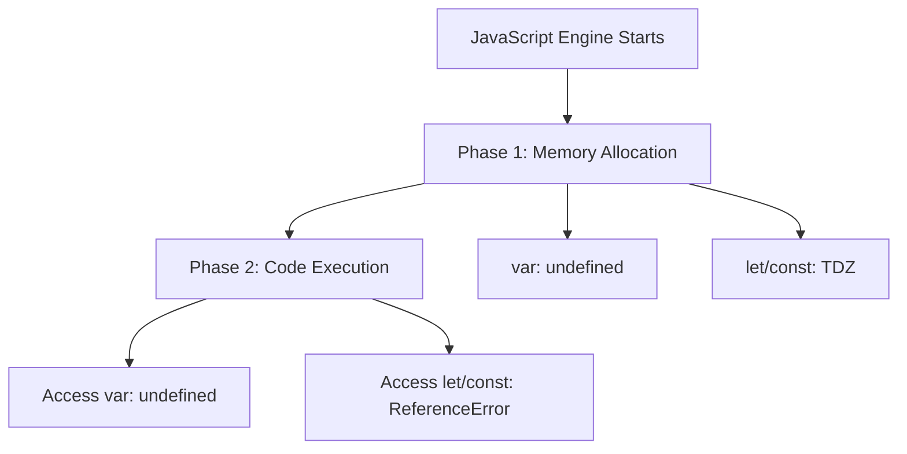
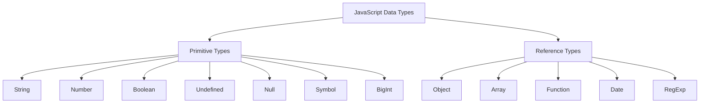
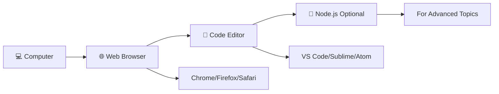

# 🚀 JavaScript Complete Learning Guide

[](https://developer.mozilla.org/en-US/docs/Web/JavaScript)
[](LICENSE)
[](README.md)

> 🎯 **Master JavaScript from Zero to Hero** - A comprehensive, interactive learning journey through modern JavaScript concepts with practical examples and hands-on exercises.

## 📋 Table of Contents

- [🎯 Learning Objectives](#-learning-objectives)
- [🗺️ Learning Workflow](#️-learning-workflow)
- [📊 Key Facts & Statistics](#-key-facts--statistics)
- [📚 Course Modules](#-course-modules)
- [🛠️ Setup & Prerequisites](#️-setup--prerequisites)
- [🎮 Interactive Features](#-interactive-features)
- [📈 Progress Tracking](#-progress-tracking)

## 🎯 Learning Objectives



## 🗺️ Learning Workflow



## 📊 Key Facts & Statistics

<details>
<summary>📈 <strong>JavaScript Usage Statistics</strong></summary>

| Metric                    | Value               | Source                |
| ------------------------- | ------------------- | --------------------- |
| **Most Popular Language** | #1 for 11+ years    | Stack Overflow Survey |
| **GitHub Repositories**   | 19.3M+ repos        | GitHub Stats          |
| **Job Market Share**      | 65%+ of dev jobs    | Developer Survey      |
| **Learning Time**         | 3-6 months (basics) | Industry Average      |
| **Salary Range**          | $70k-$150k+         | PayScale 2024         |

</details>

<details>
<summary>🎯 <strong>Learning Path Metrics</strong></summary>

| Chapter      | Estimated Time | Difficulty | Practice Exercises |
| ------------ | -------------- | ---------- | ------------------ |
| Variables    | 2-3 hours      | ⭐⭐       | 8 exercises        |
| Data Types   | 3-4 hours      | ⭐⭐⭐     | 10 exercises       |
| Operators    | 2-3 hours      | ⭐⭐       | 12 exercises       |
| Control Flow | 4-5 hours      | ⭐⭐⭐     | 15 exercises       |
| Loops        | 3-4 hours      | ⭐⭐⭐     | 10 exercises       |
| Functions    | 5-6 hours      | ⭐⭐⭐⭐   | 18 exercises       |
| Arrays       | 4-5 hours      | ⭐⭐⭐     | 15 exercises       |
| Objects      | 4-5 hours      | ⭐⭐⭐⭐   | 12 exercises       |

</details>

---

## 📚 Course Modules

### 🧠 Chapter 1: Variables - The Foundation

> **🎯 Goal**: Master variable declarations and understand scope concepts

**🔑 Key Concepts:**

- Variable containers and memory allocation
- `var`, `let`, `const` - when and why to use each
- Hoisting behavior and Temporal Dead Zone (TDZ)
- Block vs Function scope

**📊 Quick Reference:**

| Declaration | Scope    | Reassignable | Redeclarable | Hoisted        |
| ----------- | -------- | ------------ | ------------ | -------------- |
| `var`       | Function | ✅           | ✅           | ✅ (undefined) |
| `let`       | Block    | ✅           | ❌           | ✅ (TDZ)       |
| `const`     | Block    | ❌           | ❌           | ✅ (TDZ)       |

🧠 What are Variables?
Variables are containers that hold data.
They help us store, reuse, and update information in JavaScript — from simple values like
numbers to complex data like arrays and objects.
Think of a variable as a box with a name on it. You can put something inside it (a value), and later
check or change what's inside.
In JavaScript, you create these boxes using keywords: var , let , or const .

**💡 Best Practice Flow:**



**🧪 var, let, and const – Line-by-Line Comparison**

<table>
<tr>
<th>🧓 var – Old & Risky</th>
<th>🆕 let – Modern & Safe</th>
<th>🔐 const – Constant Values</th>
</tr>
<tr>
<td>

```javascript
var score = 10;
var score = 20; // ✅ OK
```

- Function scoped
- Can redeclare & reassign
- Hoisted with `undefined`

</td>
<td>

```javascript
let age = 25;
age = 30; // ✅ OK
let age = 40; // ❌ Error
```

- Block scoped
- Can reassign, not redeclare
- Hoisted in TDZ

</td>
<td>

```javascript
const PI = 3.14;
PI = 3.14159; // ❌ Error
```

- Block scoped
- Cannot reassign/redeclare
- Must initialize at declaration

</td>
</tr>
</table>

**👉 Special Case - Objects & Arrays:**

```javascript
const student = { name: "Riya" };
student.name = "Priya"; // ✅ OK - modifying contents
student = {}; // ❌ Error - reassigning variable

const colors = ["red", "blue"];
colors.push("green"); // ✅ OK - modifying array
colors = []; // ❌ Error - reassigning variable
```

**🔥 Scope Visualization**



**📍 Scope Rules:**

- **Block Scope** → Code inside `{}` (loops, if statements, etc.)
- **Function Scope** → Code inside a function
- `let` and `const` follow **block scope**
- `var` ignores block scope → **leads to bugs**

```javascript
{
  var x = 5; // Function scoped
  let y = 10; // Block scoped
  const z = 15; // Block scoped
}
console.log(x); // ✅ 5 (accessible - leaked out!)
console.log(y); // ❌ ReferenceError
console.log(z); // ❌ ReferenceError
```

**🧨 Hoisting Behavior**



**Hoisting Examples:**

```javascript
// What you write:
console.log(a); // undefined (not error!)
var a = 10;

// What JavaScript sees:
var a; // hoisted to top
console.log(a); // undefined
a = 10;
```

```javascript
// Temporal Dead Zone (TDZ)
console.log(b); // ❌ ReferenceError
let b = 20;

console.log(c); // ❌ ReferenceError
const c = 30;
```

**⚠️ Common Gotchas & Reality Checks**

<details>
<summary>🚨 <strong>Click to reveal common mistakes</strong></summary>

| ❌ **Mistake**                     | ✅ **Reality**                                  | 💡 **Why**                           |
| ---------------------------------- | ----------------------------------------------- | ------------------------------------ |
| `const` makes everything immutable | `const` protects the variable binding           | Objects/arrays can still be modified |
| `var` is the same as `let`         | `var` has function scope, `let` has block scope | Different scoping rules              |
| Hoisting moves code physically     | Only declarations are hoisted, not assignments  | Memory allocation vs execution       |
| `let`/`const` aren't hoisted       | They are hoisted but in TDZ                     | Cannot access before declaration     |

</details>

**🧠 Developer Mindset Rules**

```javascript
// 🎯 The Golden Rule
const by_default = "Use const first";
let when_reassigning = "Use let when you need to change the value";
var never_use = "Avoid var - it belongs to the past";
```

**🧪 Interactive Practice Zone**

<details>
<summary>🎮 <strong>Exercise 1: Variable Declarations</strong></summary>

```javascript
// TODO: Declare your name and city using const, age using let
// Your code here:
```

<details>
<summary>💡 Solution</summary>

```javascript
const name = "John";
const city = "New York";
let age = 25;
```

</details>
</details>

<details>
<summary>🎮 <strong>Exercise 2: Spot the Error</strong></summary>

```javascript
let x = 5;
let x = 10; // What happens here?
```

<details>
<summary>💡 Answer</summary>

**Error:** `SyntaxError: Identifier 'x' has already been declared`
**Reason:** `let` cannot be redeclared in the same scope.

</details>
</details>

<details>
<summary>🎮 <strong>Exercise 3: Hoisting Challenge</strong></summary>

```javascript
console.log(count); // Guess the output
var count = 42;
```

<details>
<summary>💡 Answer</summary>

**Output:** `undefined`
**Reason:** `var` is hoisted but initialized with `undefined`.

</details>
</details>

<details>
<summary>🎮 <strong>Exercise 4: Const Object Modification</strong></summary>

```javascript
const student = { name: "Alice" };
student.age = 20; // Will this work?
student = {}; // What about this?
```

<details>
<summary>💡 Answer</summary>

- `student.age = 20` ✅ **Works** - modifying object contents
- `student = {}` ❌ **Error** - reassigning the variable

</details>
</details>

---

### 🧠 Chapter 2: Data Types + Type System

> **🎯 Goal**: Master JavaScript's type system and understand type coercion

**📊 Type System Overview:**



📦 What Are Data Types?
In JavaScript, every value has a type.
These types define what kind of data is being stored — a number, text, boolean, object, etc.
There are two categories:
Primitive types – stored directly.
Reference types – stored as memory references.

🔹 Primitive Data Types
. String → Text
"hello" , 'Sheryians'
. Number → Any numeric value
3 , -99 , 3.14
. Boolean → True or false
true , false
. Undefined → Variable declared but not assigned
let x; → x is undefined
. Null → Intentional empty value
let x = null;
. Symbol → Unique identifier (rarely used)
. BigInt → Very large integers
123456789012345678901234567890n

🔹 Reference Data Types
Object → { name: "Harsh", age: 26 }
28/06/2025, 15:10 Complete JS Course Syllabus

6/36

Array → [10, 20, 30]
Function → function greet() {}
These are not copied directly, but by reference.

🔍 typeof Operator
Used to check the data type of a value:

Note: typeof null === "object" is a bug, but has existed since the early days of JS.

🔁 Type Coercion (Auto-Conversion)
JavaScript auto-converts types in some operations:

🚨 Loose vs Strict Equality
js
typeof "Sheryians" // "string"
typeof 99 // "number"
typeof true // "boolean"
typeof undefined // "undefined"
typeof null // "object" ← known bug
typeof [] // "object"
typeof {} // "object"
typeof function(){} // "function"

js
"5" + 1 // "51" → number converted to string
"5" - 1 // 4 → string converted to number
true + 1 // 2
null + 1 // 1
undefined + 1 // NaN
28/06/2025, 15:10 Complete JS Course Syllabus

7/36
== compares value with type conversion
=== compares value + type (no conversion)

Always prefer === for accurate comparisons.

🧪 NaN – Not a Number

Even though it means “Not a Number”, NaN is actually of type number .
This is because operations like 0 / 0 or parseInt("abc") still produce a numeric result —
just an invalid one.

🔦 Truthy and Falsy Values
Falsy values:
false , 0 , "" , null , undefined , NaN
Everything else is truthy, including:
"0" , "false" , [] , {} , function(){}
Example:
js
5 == "5" // true
5 === "5" // false

js
typeof NaN // "number"

js
if ("0") {
console.log("Runs"); // "0" is a non-empty string = truthy
}
28/06/2025, 15:10 Complete JS Course Syllabus

8/36

🧠 Mindset
JavaScript will often auto-convert types behind the scenes.
Always stay aware of what data type you’re working with.

❓ Common Confusions
typeof null is "object" — this is a bug.
undefined means the variable was never assigned.
null means you intentionally set it to "nothing".
'5' + 1 is "51" but '5' - 1 is 4 .

🧪 Practice Zone
. Predict the output:

. Check types:

. Truthy or Falsy?
js
console.log(null + 1);
console.log("5" + 3);
console.log("5" - 3);
console.log(true + false);

js
console.log(typeof []);
console.log(typeof null);
console.log(typeof 123n);

js
28/06/2025, 15:10 Complete JS Course Syllabus

9/36

. Write a function isEmpty(value) that checks if a given value is null , undefined , or "" .
. Compare with loose vs strict:
console.log(Boolean(0)); // falsy
console.log(Boolean("0")); // truthy
console.log(Boolean([])); // truthy
console.log(Boolean(undefined));// falsy

js
console.log(5 == "5"); // ?
console.log(5 === "5"); // ?

🔄 Chapter 3: Operators

(JavaScript – Learn Everything Series by Sheryians Coding School)

🔧 What are Operators?
Operators are special symbols or keywords in JavaScript used to perform operations on values
(operands).
You’ll use them in calculations, comparisons, logic, assignments, and even type checks.
Think of them as the verbs of your code — they act on data.

➕ Arithmetic Operators
Used for basic math.
js

- // addition

* // subtraction

- // multiplication
  28/06/2025, 15:10 Complete JS Course Syllabus

10/36

Example:

🧮 Assignment Operators
Assign values to variables.

Example:

🧾 Comparison Operators
Used in condition checks.
/ // division
% // modulus (remainder)
\*\* // exponentiation (power)

js
let a = 10, b = 3;
console.log(a + b); // 13
console.log(a % b); // 1
console.log(2 \*\* 3); // 8

js
= // assigns value
+= // a += b => a = a + b
-= // a -= b
\*=, /=, %=

js
let score = 5;
score += 2; // score = 7

js
28/06/2025, 15:10 Complete JS Course Syllabus

11/36

Example:

✅ Logical Operators
Used to combine multiple conditions.

Example:

🌀 Unary Operators
Used on a single operand.
== // equal (loose)
=== // equal (strict – value + type)
!= // not equal (loose)
!== // not equal (strict)

> < >= <=

js
console.log(5 == "5"); // true
console.log(5 === "5"); // false

js
&& // AND – both must be true
|| // OR – either one true
! // NOT – negates truthiness

js
let age = 20, hasID = true;
if (age >= 18 && hasID) {
console.log("Allowed");
}

js
28/06/2025, 15:10 Complete JS Course Syllabus

12/36

Example:

❓ Ternary Operator (Conditional)
Shorthand for if...else

Example:

🧪 typeof Operator

- // tries to convert to number

* // negates
  ++ // increment
  -- // decrement
  typeof // returns data type

js
let x = "5";
console.log(+x); // 5 (converted to number)

js
condition ? valueIfTrue : valueIfFalse

js
let score = 80;
let grade = score > 50 ? "Pass" : "Fail";

js
typeof 123 // "number"
typeof "hi" // "string"
typeof null // "object" (JS bug)
typeof [] // "object"
28/06/2025, 15:10 Complete JS Course Syllabus

13/36

🧠 Mindset
Operators make logic happen.
They help you make decisions, combine values, and create expressions.
Try to:
Use === instead of == to avoid type bugs.
Use ternary for quick decisions, not complex ones.
Think in truthy/falsy when using && , || , ! .

❓ Common Confusions
"5" + 1 is "51" (string concat), but "5" - 1 is 4 (number subtract)
!!value is a quick trick to convert anything into a boolean
Pre-increment ( ++i ) vs post-increment ( i++ ) return different results

🧪 Practice Zone
. Predict:

. Convert using unary +
typeof {} // "object"
typeof function(){} // "function"

js
console.log("10" + 1);
console.log("10" - 1);
console.log(true + false);
console.log(!!"Sheryians");

js
28/06/2025, 15:10 Complete JS Course Syllabus

14/36

. Use ternary:

. Build a calculator:

. Score logic:
let str = "42";
let num = +str;
console.log(num); // 42

js
let age = 17;
let msg = age >= 18 ? "Adult" : "Minor";

js
// Using switch + arithmetic operators
function calc(a, b, operator) {
// +, -, \*, /
}

js
let marks = 82;
// Print "Excellent", "Good", "Average", or "Fail" based on ranges

🧭 Chapter 4: Control Flow

(JavaScript – Learn Everything Series by Sheryians Coding School)
28/06/2025, 15:10 Complete JS Course Syllabus

15/36

🚦 What is Control Flow?
Control flow decides which code runs, when it runs, and how many times it runs.
It's like decision-making + direction in your JavaScript program.
If operators are the verbs, control flow is the traffic signal.

🧱 if, else if, else

✅ Example:

🌀 switch-case
Great for checking one variable against many values.
js
if (condition) {
// runs if condition is true
} else if (anotherCondition) {
// runs if first was false, second is true
} else {
// runs if none are true
}

js
let marks = 78;
if (marks >= 90) {
console.log("A");
} else if (marks >= 75) {
console.log("B");
} else {
console.log("C");
}

js
28/06/2025, 15:10 Complete JS Course Syllabus

16/36

✅ Example:

🔁 Early Return Pattern
Used in functions to exit early if some condition fails.
switch (value) {
case value1:
// code
break;
case value2:
// code
break;
default:
// fallback
}

js
let fruit = "apple";
switch (fruit) {
case "banana":
console.log("Yellow");
break;
case "apple":
console.log("Red");
break;
default:
console.log("Unknown");
}

js
function checkAge(age) {
if (age < 18) return "Denied";
return "Allowed";
}
28/06/2025, 15:10 Complete JS Course Syllabus

17/36
This avoids deep nesting and makes logic cleaner.

⚠️ Common Confusions
switch-case executes all cases after a match unless you break
else if chain works top-down — order matters
You can use truthy/falsy values directly in if

🧠 Mindset
Control flow = conditional storytelling.
It helps your program make choices and respond differently to different inputs.
Write readable branches. Avoid nesting too deep — use early return if needed.

🧪 Practice Zone
. Student grade logic:

. Rock-paper-scissors:

. Login message:
js
// Write a program that prints A, B, C, D, or F based on marks

js
// Given player1 and player2's choice, print winner or draw

js
28/06/2025, 15:10 Complete JS Course Syllabus

18/36

. Weather advice:

. Age checker:
let isLoggedIn = true;
let isAdmin = false;
// Show different messages based on combination

js
let weather = "rainy";
// Use switch-case to print what to wear

js
// Return "Kid", "Teen", "Adult", or "Senior"

🔁 Chapter 5: Loops

(JavaScript – Learn Everything Series by Sheryians Coding School)

🔄 Why Loops?
Loops help us repeat code without rewriting it.
If a task needs to be done multiple times (e.g., printing 1–10, going through an array, or
checking each character in a string), loops are the backbone.
28/06/2025, 15:10 Complete JS Course Syllabus

19/36

🔁 for Loop

Start from i = 0
Run till i < 5
Increase i each time

🔁 while Loop

Condition is checked before running

🔁 do-while Loop

Runs at least once, even if condition is false
js
for (let i = 0; i < 5; i++) {
console.log(i);
}

js
let i = 0;
while (i < 5) {
console.log(i);
i++;
}

js
let i = 0;
do {
console.log(i);
i++;
} while (i < 5);
28/06/2025, 15:10 Complete JS Course Syllabus

20/36

⛔ break and continue
break : Exit loop completely
continue : Skip current iteration and move to next

🌀 for-of – Arrays & Strings

Works on anything iterable (arrays, strings)

🧱 forEach – Arrays

Cleaner than for for arrays, but you can’t break/return
js
for (let i = 1; i <= 5; i++) {
if (i === 3) continue;
console.log(i); // Skips 3
}

js
for (let char of "Sheryians") {
console.log(char);
}

js
let nums = [10, 20, 30];
nums.forEach((num) => {
console.log(num);
});
28/06/2025, 15:10 Complete JS Course Syllabus

21/36
🧱 for-in – Objects (and arrays if needed)

Goes over keys in objects

⚠️ Common Confusions
for-in is for objects, not arrays (may cause issues with unexpected keys)
forEach can't use break or continue
while and do-while work best when number of iterations is unknown

🧠 Mindset
Loops = data processor.
Use the right loop for the job:
for = best for numbers/indexes
for-of = for array values
for-in = for object keys
while = for unpredictable conditions

🧪 Practice Zone
. Print 1 to 10 using for
. Print even numbers between 1 to 20
. Reverse a string using loop
js
let user = { name: "Harsh", age: 26 };
for (let key in user) {
console.log(key, user[key]);
}
28/06/2025, 15:10 Complete JS Course Syllabus

22/36

. Sum of all numbers in an array
. Print all characters of a name using for-of
. Print all object keys and values using for-in
. Use continue to skip a specific number
. Guess number game – use while to ask until correct
. Pattern: Print triangle using \*
. Sum of even numbers in an array using forEach

🧮 Chapter 6: Functions

(JavaScript – Learn Everything Series by Sheryians Coding School)

🧠 What are Functions?
Functions are blocks of reusable logic.
Instead of repeating the same task again and again, wrap it in a function and reuse it with
different inputs.
Think of a function like a vending machine:
Input: you give money + item code
Output: it gives you the item
Logic: hidden inside

️ Function Declarations
js
28/06/2025, 15:10 Complete JS Course Syllabus

23/36
You define it once, then call it whenever needed.

🧾 Parameters vs Arguments

name is a parameter
"Harsh" is the argument you pass

🌀 Return Values

return sends back a result to wherever the function was called
After return , function exits

🧰 Function Expressions
function greet() {
console.log("Welcome to Sheryians!");
}
greet();

js
function greet(name) {
console.log("Hello " + name);
}
greet("Harsh");

js
function sum(a, b) {
return a + b;
}
let total = sum(5, 10); // total is 15
28/06/2025, 15:10 Complete JS Course Syllabus

24/36

Functions stored in variables
Cannot be hoisted (you can’t call them before they’re defined)

🏹 Arrow Functions

Cleaner syntax
No own this , no arguments object

🧂 Default + Rest + Spread
js
const greet = function () {
console.log("Hello!");
};

js
const greet = () => {
console.log("Hi!");
};

js
function multiply(a = 1, b = 1) {
return a \* b;
}
function sum(...nums) {
return nums.reduce((acc, val) => acc + val, 0);
}
let nums = [1, 2, 3];
console.log(sum(...nums)); // Spread
28/06/2025, 15:10 Complete JS Course Syllabus

25/36

a = 1 → default parameter
...nums → rest parameter
...nums (in call) → spread operator

🎯 First-Class Functions
JavaScript treats functions as values:
Assign to variables
Pass as arguments
Return from other functions

🧠 Higher-Order Functions (HOF)
Functions that accept other functions or return functions.
js
function shout(msg) {
return msg.toUpperCase();
}
function processMessage(fn) {
console.log(fn("hello"));
}
processMessage(shout);

js
function createMultiplier(x) {
return function (y) {
return x \* y;
};
}
let double = createMultiplier(2);
console.log(double(5)); // 10
28/06/2025, 15:10 Complete JS Course Syllabus

26/36

🔐 Closures & Lexical Scope
Closures = when a function remembers its parent scope, even after the parent has finished.

Even after outer is done, counter still remembers count .

⚡ IIFE – Immediately Invoked Function Expression

Used to create private scope instantly.

🚀 Hoisting: Declarations vs Expressions
js
function outer() {
let count = 0;
return function () {
count++;
console.log(count);
};
}
let counter = outer();
counter(); // 1
counter(); // 2

js
(function () {
console.log("Runs immediately");
})();

js
hello(); // works
function hello() {
console.log("Hi");
}
28/06/2025, 15:10 Complete JS Course Syllabus

27/36

Declarations are hoisted
Expressions are not

⚠️ Common Confusions
Arrow functions don’t have their own this
You can’t break out of forEach
Closures often trap old variable values
Return vs console.log – don't mix them up

🧠 Mindset
Functions are your logic blocks + memory holders (via closure).
They keep your code clean, DRY, and reusable.

🧪 Practice Zone
. Write a BMI calculator function
. Create a greet function with default name
. Sum all numbers using rest parameter
. Create a closure counter function
. Write a function that returns another function
. Use a function to log even numbers in array
. Create a pure function to add tax
greet(); // error
const greet = function () {
console.log("Hi");
};
28/06/2025, 15:10 Complete JS Course Syllabus

28/36

. Use IIFE to show welcome message
. Write a discount calculator (HOF style)
. Make a toUpperCase transformer using HOF

🧰 Chapter 7: Arrays

(JavaScript – Learn Everything Series by Sheryians Coding School)

🧠 What is an Array?
An array is like a row of boxes, where each box holds a value and has an index (0, 1, 2...).
Arrays help you store multiple values in a single variable — numbers, strings, or even
objects/functions.

️ Creating & Accessing Arrays

Indexing starts from 0
You can access, update, or overwrite values by index
js
let fruits = ["apple", "banana", "mango"];

js
let marks = [90, 85, 78];
console.log(marks[1]); // 85
marks[2] = 80; // Update index 2
28/06/2025, 15:10 Complete JS Course Syllabus

29/36

⚙️ Common Array Methods
🧱 Modifiers (Change original array)

🔍 Extractors (Don't modify original array)

🔄 Iteration Methods
map()
Returns a new array with modified values.

filter()
js
let arr = [1, 2, 3, 4];
arr.push(5); // Add to end
arr.pop(); // Remove last
arr.shift(); // Remove first
arr.unshift(0); // Add to start
arr.splice(1, 2); // Remove 2 items starting at index 1
arr.reverse(); // Reverse order

js
let newArr = arr.slice(1, 3); // Copy from index 1 to 2
arr.sort(); // Lexical sort by default

js
let prices = [100, 200, 300];
let taxed = prices.map(p => p \* 1.18);
28/06/2025, 15:10 Complete JS Course Syllabus

30/36
Filters out elements based on a condition.

reduce()
Reduces the array to a single value.

forEach()
Performs an action for each element (but returns undefined).

find(), some(), every()

✂️ Destructuring & Spread
js
let nums = [1, 2, 3, 4];
let even = nums.filter(n => n % 2 === 0);

js
let total = nums.reduce((acc, val) => acc + val, 0);

js
nums.forEach(n => console.log(n));

js
nums.find(n => n > 2); // First match
nums.some(n => n > 5); // At least one true
nums.every(n => n > 0); // All true

js
let [first, second] = ["a", "b", "c"];
let newArr = [...nums, 99]; // Spread to copy & add
28/06/2025, 15:10 Complete JS Course Syllabus

31/36

⚠️ Common Confusions
splice changes original array, slice does not
forEach vs map : map returns a new array
sort() converts values to strings unless compareFn is provided:

Use:

🧠 Mindset
Arrays are structured, transformable data.
You loop over them, transform them, filter them, or reduce them — all to control what shows up
in your UI or logic.

🧪 Practice Zone
. Create an array of student names and print each
. Filter even numbers from an array
. Map prices to include GST (18%)
. Reduce salaries to calculate total payroll
. Find the first student with grade A
. Write a function to reverse an array
. Sort array of ages in ascending order
js
[10, 2, 3].sort(); // [10, 2, 3] → ["10", "2", "3"] → wrong order

js
arr.sort((a, b) => a - b); // Correct numeric sort
28/06/2025, 15:10 Complete JS Course Syllabus

32/36
. Destructure first two elements of an array
. Use some() to check if any student failed
. Use spread to copy and add new item

🧱 Chapter 8: Objects

(JavaScript – Learn Everything Series by Sheryians Coding School)

🧠 What is an Object?
Objects in JavaScript are like real-world records – a collection of key-value pairs.
They help us store structured data (like a student, a product, or a user profile).

🔑 Key-Value Structure
Keys are always strings (even if you write them as numbers or identifiers)
Values can be anything – string, number, array, object, function, etc.
js
let student = {
name: "Ravi",
age: 21,
isEnrolled: true
};

js
console.log(student["name"]); // Ravi
console.log(student.age); // 21
28/06/2025, 15:10 Complete JS Course Syllabus

33/36

📍 Dot vs Bracket Notation
Use dot notation for fixed key names
Use bracket notation for dynamic or multi-word keys

️ Nesting and Deep Access
Objects can have nested objects (objects inside objects)

✂️ Object Destructuring
You can extract values directly:

For nested objects:
js
student["full name"] = "Ravi Kumar"; // ✅
student.course = "JavaScript"; // ✅

js
let user = {
name: "Amit",
address: {
city: "Delhi",
pincode: 110001
}
};
console.log(user.address.city); // Delhi

js
let { name, age } = student;
28/06/2025, 15:10 Complete JS Course Syllabus

34/36

🔁 Looping Through Objects
for-in loop

Object.keys(), Object.values(), Object.entries()

📦 Copying Objects
Shallow Copy (one level deep)

Deep Copy (nested levels)
js
let {
address: { city }
} = user;

js
for (let key in student) {
console.log(key, student[key]);
}

js
Object.keys(student); // ["name", "age", "isEnrolled"]
Object.entries(student); // [["name", "Ravi"], ["age", 21], ...]

js
let newStudent = { ...student };
let newOne = Object.assign({}, student);

js
let deepCopy = JSON.parse(JSON.stringify(user));
28/06/2025, 15:10 Complete JS Course Syllabus

35/36

❓ Optional Chaining
Avoids errors if a nested property is undefined:

🧠 Computed Properties
You can use variables as keys:

⚠️ Common Confusions
Shallow copy copies only the first level
for-in includes inherited keys (be cautious!)
delete obj.key removes the property
Spread ≠ deep copy

🧠 Mindset
❗ Note: JSON-based copy works only for plain data (no functions, undefined, etc.)

js
console.log(user?.address?.city); // Delhi
console.log(user?.profile?.email); // undefined (no error)

js
let key = "marks";
let report = {
[key]: 89
};
28/06/2025, 15:10 Complete JS Course Syllabus

36/36

Objects are structured state – perfect for modeling anything complex: a user, a form, a product,
etc.
Use destructuring, chaining, and dynamic keys wisely.

🧪 Practice Zone
. Create an object for a book (title, author, price)
. Access properties using both dot and bracket
. Write a nested object (user with address and location)
. Destructure name and age from a student object
. Loop through keys and values of an object
. Convert object to array using Object.entries()
. Copy an object using spread operator
. Create a deep copy of an object with nested structure
. Use optional chaining to safely access deep values
. Use a variable as a key using computed properties

- --

## 🛠️ Setup & Prerequisites

### 📋 What You Need



### 🚀 Quick Start

1. **Clone this repository:**

   ```bash
   git clone https://github.com/Santoshpatel112/JAVASCRIPT-P1.git
   cd JAVASCRIPT-P1
   ```

2. **Open in your browser:**

   ```bash
   # Open index.html in your browser
   # Or use Live Server extension in VS Code
   ```

3. **Start learning:**
   - Read each chapter in order
   - Practice with the provided exercises
   - Check your understanding with quizzes

### 🎮 Interactive Features

<details>
<summary>🔧 <strong>Built-in Tools</strong></summary>

- **📝 Code Playground**: Interactive code examples you can modify
- **🧪 Practice Exercises**: Hands-on coding challenges
- **📊 Progress Tracking**: Visual progress indicators
- **🎯 Quizzes**: Knowledge check points
- **💡 Hints & Solutions**: Step-by-step guidance
- **📚 Reference Cards**: Quick lookup tables

</details>

<details>
<summary>📈 <strong>Progress Tracking</strong></summary>

Track your learning journey:

- [ ] Chapter 1: Variables ⭐⭐
- [ ] Chapter 2: Data Types ⭐⭐⭐
- [ ] Chapter 3: Operators ⭐⭐
- [ ] Chapter 4: Control Flow ⭐⭐⭐
- [ ] Chapter 5: Loops ⭐⭐⭐
- [ ] Chapter 6: Functions ⭐⭐⭐⭐
- [ ] Chapter 7: Arrays ⭐⭐⭐
- [ ] Chapter 8: Objects ⭐⭐⭐⭐

**Legend:** ⭐ = Difficulty Level

</details>

### 🤝 Contributing

Found an error or want to improve something?

1. Fork the repository
2. Create a feature branch
3. Make your changes
4. Submit a pull request

### 📞 Support & Community

- 🐛 **Issues**: [Report bugs here](https://github.com/Santoshpatel112/JAVASCRIPT-P1/issues)
- 💬 **Discussions**: [Join the community](https://github.com/Santoshpatel112/JAVASCRIPT-P1/discussions)
- 📧 **Contact**: [Your Email](mailto:your.email@example.com)

### 📄 License

This project is licensed under the MIT License - see the [LICENSE](LICENSE) file for details.

---

<div align="center">

**🎉 Happy Learning! 🎉**

_Made with ❤️ for JavaScript learners everywhere_

[](https://github.com/Santoshpatel112/JAVASCRIPT-P1)
[](https://github.com/Santoshpatel112/JAVASCRIPT-P1/fork)

</div>
