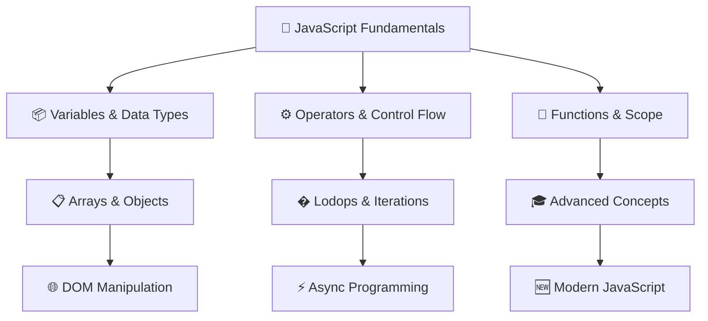
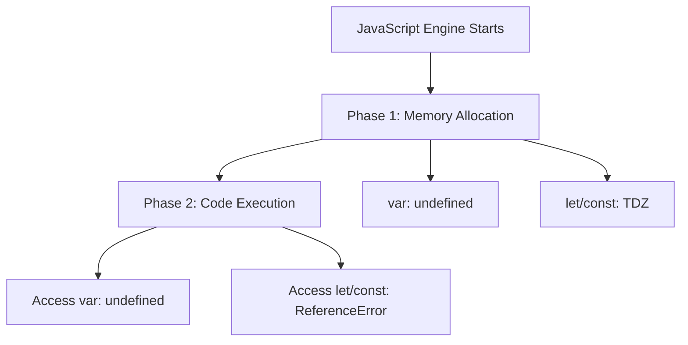
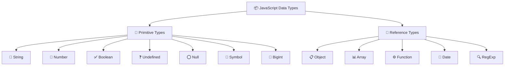
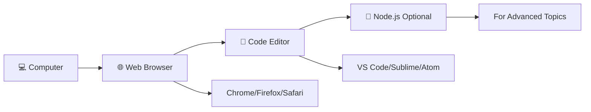

# 🚀 **JavaScript Complete Learning Guide**

<div align="center">


[](https://developer.mozilla.org/en-US/docs/Web/JavaScript)
[](LICENSE)
[](README.md)
[](https://github.com/Santoshpatel112/JAVASCRIPT-P1)

</div>

> 🎯 **Master JavaScript from Zero to Hero** - A comprehensive, interactive learning journey through modern JavaScript concepts with practical examples and hands-on exercises.

---

## � **Table of Contents**

- [🎯 Learning Objectives](#-learning-objectives)
- [🗺️ Learning Workflow](#️-learning-workflow)
- [📊 Key Facts & Statistics](#-key-facts--statistics)
- [📚 Course Modules](#-course-modules)
- [🛠️ Setup & Prerequisites](#️-setup--prerequisites)
- [🎮 Interactive Features](#-interactive-features)
- [📈 Progress Tracking](#-progress-tracking)

---

## 🎯 **Learning Objectives**



---

## 🗺️ **Learning Workflow**


---

## 📊 **Key Facts & Statistics**

<details>
<summary>📈 <strong>JavaScript Usage Statistics</strong></summary>

| 🏆 **Metric**             | 📊 **Value**        | 📚 **Source**         |
| ------------------------- | ------------------- | --------------------- |
| **Most Popular Language** | #1 for 11+ years    | Stack Overflow Survey |
| **GitHub Repositories**   | 19.3M+ repos        | GitHub Stats          |
| **Job Market Share**      | 65%+ of dev jobs    | Developer Survey      |
| **Learning Time**         | 3-6 months (basics) | Industry Average      |
| **Salary Range**          | $70k-$150k+         | PayScale 2024         |

</details>

<details>
<summary>🎯 <strong>Learning Path Metrics</strong></summary>

| � **Chapter**u | ⏱️ **Time** | 🌟 **Difficulty** | 🎮 **Exercises** |
| -------------- | ----------- | ----------------- | ---------------- |
| Variables      | 2-3 hours   | ⭐⭐              | 8 exercises      |
| Data Types     | 3-4 hours   | ⭐⭐⭐            | 10 exercises     |
| Operators      | 2-3 hours   | ⭐⭐              | 12 exercises     |
| Control Flow   | 4-5 hours   | ⭐⭐⭐            | 15 exercises     |
| Loops          | 3-4 hours   | ⭐⭐⭐            | 10 exercises     |
| Functions      | 5-6 hours   | ⭐⭐⭐⭐          | 18 exercises     |
| Arrays         | 4-5 hours   | ⭐⭐⭐            | 15 exercises     |
| Objects        | 4-5 hours   | ⭐⭐⭐⭐          | 12 exercises     |

</details>

---

## 📚 **Course Modules**

### 🧠 **Chapter 1: Variables - The Foundation**

<div align="center">


</div>

> **🎯 Goal**: Master variable declarations and understand scope concepts

**🔑 Key Concepts:**

- 📦 Variable containers and memory allocation
- � `evar`, `let`, `const` - when and why to use each
- 🚀 Hoisting behavior and Temporal Dead Zone (TDZ)
- 🏠 Block vs Function scope

**📊 Quick Reference:**

| 🏷️ **Declaration** | 🏠 **Scope** | 🔄 **Reassignable** | 🔁 **Redeclarable** | 🚀 **Hoisted** |
| ------------------ | ------------ | ------------------- | ------------------- | -------------- |
| `var`              | Function     | ✅                  | ✅                  | ✅ (undefined) |
| `let`              | Block        | ✅                  | ❌                  | ✅ (TDZ)       |
| `const`            | Block        | ❌                  | ❌                  | ✅ (TDZ)       |

**💡 Best Practice Decision Tree:**

```
🤔 Need a Variable?
    ↓
🔄 Will it change?
    ├─ No → ✅ Use const
    └─ Yes → 📦 Primitive or Object?
              ├─ Primitive → ✅ Use let
              └─ Object/Array → 📝 Contents change?
                                ├─ Yes → ✅ Use const
                                └─ No → ✅ Use let
```

**🧪 var, let, and const Comparison**

<table>
<tr>
<th>🧓 <strong>var - Old & Risky</strong></th>
<th>🆕 <strong>let - Modern & Safe</strong></th>
<th>🔐 <strong>const - Constant Values</strong></th>
</tr>
<tr>
<td>

```javascript
var score = 10;
var score = 20; // ✅ OK
```

- Function scoped
- Can redeclare & reassign
- Hoisted with `undefined`

</td>
<td>

```javascript
let age = 25;
age = 30; // ✅ OK
let age = 40; // ❌ Error
```

- Block scoped
- Can reassign, not redeclare
- Hoisted in TDZ

</td>
<td>

```javascript
const PI = 3.14;
PI = 3.14159; // ❌ Error
```

- Block scoped
- Cannot reassign/redeclare
- Must initialize at declaration

</td>
</tr>
</table>

**👉 Special Case - Objects & Arrays:**

```javascript
const student = { name: "Riya" };
student.name = "Priya"; // ✅ OK - modifying contents
student = {}; // ❌ Error - reassigning variable

const colors = ["red", "blue"];
colors.push("green"); // ✅ OK - modifying array
colors = []; // ❌ Error - reassigning variable
```

**🔥 Scope Visualization**

```
🌍 Global Scope
├── var globalVar
├── let globalLet
├── const globalConst
└── 🏠 Function Scope
    ├── var functionVar
    ├── let functionLet
    ├── const functionConst
    └── 📦 Block Scope {}
        ├── let blockLet
        ├── const blockConst
        └── var leaksOut ⚠️ (WARNING: escapes block!)
```

**📍 Scope Rules:**

- **Block Scope** → Code inside `{}` (loops, if statements, etc.)
- **Function Scope** → Code inside a function
- `let` and `const` follow **block scope**
- `var` ignores block scope → **leads to bugs**

```javascript
{
  var x = 5; // Function scoped
  let y = 10; // Block scoped
  const z = 15; // Block scoped
}
console.log(x); // ✅ 5 (accessible - leaked out!)
console.log(y); // ❌ ReferenceError
console.log(z); // ❌ ReferenceError
```

**🧨 Hoisting Behavior**



**Hoisting Examples:**

```javascript
// What you write:
console.log(a); // undefined (not error!)
var a = 10;

// What JavaScript sees:
var a; // hoisted to top
console.log(a); // undefined
a = 10;
```

```javascript
// Temporal Dead Zone (TDZ)
console.log(b); // ❌ ReferenceError
let b = 20;

console.log(c); // ❌ ReferenceError
const c = 30;
```

**⚠️ Common Gotchas & Reality Checks**

<details>
<summary>🚨 <strong>Click to reveal common mistakes</strong></summary>

| ❌ **Mistake**                     | ✅ **Reality**                                  | 💡 **Why**                           |
| ---------------------------------- | ----------------------------------------------- | ------------------------------------ |
| `const` makes everything immutable | `const` protects the variable binding           | Objects/arrays can still be modified |
| `var` is the same as `let`         | `var` has function scope, `let` has block scope | Different scoping rules              |
| Hoisting moves code physically     | Only declarations are hoisted, not assignments  | Memory allocation vs execution       |
| `let`/`const` aren't hoisted       | They are hoisted but in TDZ                     | Cannot access before declaration     |

</details>

**🧠 Developer Mindset Rules**

```javascript
// 🎯 The Golden Rule
const by_default = "Use const first";
let when_reassigning = "Use let when you need to change the value";
var never_use = "Avoid var - it belongs to the past";
```

**🧪 Interactive Practice Zone**

<details>
<summary>🎮 <strong>Exercise 1: Variable Declarations</strong></summary>

```javascript
// TODO: Declare your name and city using const, age using let
// Your code here:
```

<details>
<summary>💡 Solution</summary>

```javascript
const name = "John";
const city = "New York";
let age = 25;
```

</details>
</details>

<details>
<summary>🎮 <strong>Exercise 2: Spot the Error</strong></summary>

```javascript
let x = 5;
let x = 10; // What happens here?
```

<details>
<summary>💡 Answer</summary>

**Error:** `SyntaxError: Identifier 'x' has already been declared`
**Reason:** `let` cannot be redeclared in the same scope.

</details>
</details>

<details>
<summary>🎮 <strong>Exercise 3: Hoisting Challenge</strong></summary>

```javascript
console.log(count); // Guess the output
var count = 42;
```

<details>
<summary>💡 Answer</summary>

**Output:** `undefined`
**Reason:** `var` is hoisted but initialized with `undefined`.

</details>
</details>

---

### � **Chapter 2: Data Types + Type System**

<div align="center">


</div>

> **🎯 Goal**: Master JavaScript's type system and understand type coercion

**📊 Type System Overview:**



**🔹 Primitive Data Types**

| 🏷️ **Type** | 📝 **Description** | 💡 **Examples**                   |
| ----------- | ------------------ | --------------------------------- |
| **String**  | Text data          | `"hello"`, `'JavaScript'`         |
| **Number**  | Numeric values     | `42`, `-99`, `3.14`               |
| **Boolean** | True/false values  | `true`, `false`                   |
| **Symbol**  | Unique identifier  | `Symbol('id')`                    |
| **BigInt**  | Large integers     | `123456789012345678901234567890n` |

---

### 🔍 **Understanding `undefined` vs `null` - The Complete Guide**

Let me explain the difference clearly and simply, with examples.

#### ✅ **1️⃣ What is `undefined`?**

`undefined` means a variable has been **declared but never assigned a value**.
It happens **automatically** in JavaScript.

**Example:**

```javascript
let a;
console.log(a); // Output: undefined
```

👉 Here, `a` is declared but not assigned any value, so its value is `undefined`.

**Another Example:**

```javascript
function greet(name) {
  console.log(name);
}

greet(); // Output: undefined
```

👉 We didn't pass any argument, so `name` is `undefined`.

#### ✅ **2️⃣ What is `null`?**

`null` is something you assign **intentionally** to a variable to say:
👉 **"This variable should have no value."**

**Example:**

```javascript
let user = null;
console.log(user); // Output: null
```

This shows that we **intentionally** set `user` to have "no value".

#### ✅ **3️⃣ Key Differences:**

| 🏷️ **Feature**              | 🔹 **undefined**              | 🔸 **null**                      |
| --------------------------- | ----------------------------- | -------------------------------- |
| **Type**                    | `undefined`                   | `object`                         |
| **Assigned automatically?** | ✅ Yes                        | ❌ No (you set it)               |
| **Purpose**                 | Indicates "value not yet set" | Represents "no value" explicitly |
| **Example**                 | `let x;` → `x === undefined`  | `let x = null;` → `x === null`   |

#### ✅ **4️⃣ When to Use Which?**

- **Use `undefined`** when a variable is uninitialized by the system.
- **Use `null`** when you want to deliberately clear a variable or indicate "empty".

#### ✅ **5️⃣ Important Note:**

```javascript
console.log(typeof undefined); // "undefined"
console.log(typeof null); // "object" (this is a JavaScript quirk)
```

#### 🔥 **In Summary:**

- **`undefined`**: JavaScript sets it by default when a variable has no value.
- **`null`**: You explicitly assign it to indicate "empty" or "no value".

**🔸 Reference Data Types**

| 🏷️ **Type**  | 📝 **Description**   | 💡 **Examples**             |
| ------------ | -------------------- | --------------------------- |
| **Object**   | Key-value pairs      | `{ name: "John", age: 25 }` |
| **Array**    | Ordered list         | `[10, 20, 30]`              |
| **Function** | Reusable code blocks | `function greet() {}`       |

**🔍 typeof Operator**

```javascript
typeof "JavaScript"; // "string"
typeof 99; // "number"
typeof true; // "boolean"
typeof undefined; // "undefined"
typeof null; // "object" ← 🐛 known bug
typeof []; // "object"
typeof {}; // "object"
typeof function () {}; // "function"
```

**🔁 Type Coercion (Auto-Conversion)**

```javascript
"5" + 1; // "51" → number converted to string
"5" - 1; // 4 → string converted to number
true + 1; // 2
null + 1; // 1
undefined + 1; // NaN
```

**🚨 Loose vs Strict Equality**

```javascript
5 == "5"; // true  (loose - with type conversion)
5 === "5"; // false (strict - no conversion)
```

> 💡 **Always prefer `===` for accurate comparisons**

**🧪 NaN - Not a Number**

```javascript
typeof NaN; // "number" (confusing but true!)
```

Even though it means "Not a Number", `NaN` is actually of type `number`. This happens because operations like `0 / 0` or `parseInt("abc")` still produce a numeric result — just an invalid one.

**🔦 Truthy and Falsy Values**

**❌ Falsy values (only 6):**

- `false`
- `0`
- `""`
- `null`
- `undefined`
- `NaN`

**✅ Everything else is truthy, including:**

- `"0"` (non-empty string)
- `"false"` (non-empty string)
- `[]` (empty array)
- `{}` (empty object)
- `function(){}` (functions)

```javascript
if ("0") {
  console.log("Runs"); // "0" is a non-empty string = truthy
}
```

**🧪 Interactive Practice Zone**

<details>
<summary>🎮 <strong>Exercise 1: Type Prediction</strong></summary>

```javascript
console.log(null + 1); // ?
console.log("5" + 3); // ?
console.log("5" - 3); // ?
console.log(true + false); // ?
```

<details>
<summary>💡 Answer</summary>

```javascript
console.log(null + 1); // 1
console.log("5" + 3); // "53"
console.log("5" - 3); // 2
console.log(true + false); // 1
```

</details>
</details>

<details>
<summary>🎮 <strong>Exercise 2: Type Checking</strong></summary>

```javascript
console.log(typeof []); // ?
console.log(typeof null); // ?
console.log(typeof 123n); // ?
```

<details>
<summary>💡 Answer</summary>

```javascript
console.log(typeof []); // "object"
console.log(typeof null); // "object" (bug!)
console.log(typeof 123n); // "bigint"
```

</details>
</details>

---

## 🛠️ **Setup & Prerequisites**

### 📋 **What You Need**



### 🚀 **Quick Start**

1. **📥 Clone this repository:**

   ```bash
   git clone https://github.com/Santoshpatel112/JAVASCRIPT-P1.git
   cd JAVASCRIPT-P1
   ```

2. **🌐 Open in your browser:**

   ```bash
   # Open index.html in your browser
   # Or use Live Server extension in VS Code
   ```

3. **📚 Start learning:**
   - Read each chapter in order
   - Practice with the provided exercises
   - Check your understanding with quizzes

### 🎮 **Interactive Features**

<details>
<summary>🔧 <strong>Built-in Tools</strong></summary>

- **📝 Code Playground**: Interactive code examples you can modify
- **🧪 Practice Exercises**: Hands-on coding challenges
- **📊 Progress Tracking**: Visual progress indicators
- **🎯 Quizzes**: Knowledge check points
- **💡 Hints & Solutions**: Step-by-step guidance
- **📚 Reference Cards**: Quick lookup tables

</details>

### 📈 **Progress Tracking**

Track your learning journey:

- [ ] **Chapter 1**: Variables ⭐⭐
- [ ] **Chapter 2**: Data Types ⭐⭐⭐
- [ ] **Chapter 3**: Operators ⭐⭐
- [ ] **Chapter 4**: Control Flow ⭐⭐⭐
- [ ] **Chapter 5**: Loops ⭐⭐⭐
- [ ] **Chapter 6**: Functions ⭐⭐⭐⭐
- [ ] **Chapter 7**: Arrays ⭐⭐⭐
- [ ] **Chapter 8**: Objects ⭐⭐⭐⭐

**Legend:** ⭐ = Difficulty Level

---

## 🤝 **Contributing**

Found an error or want to improve something?

1. 🍴 Fork the repository
2. 🌿 Create a feature branch
3. ✏️ Make your changes
4. 📤 Submit a pull request

---

## 📞 **Support & Community**

- 🐛 **Issues**: [Report bugs here](https://github.com/Santoshpatel112/JAVASCRIPT-P1/issues)
- 💬 **Discussions**: [Join the community](https://github.com/Santoshpatel112/JAVASCRIPT-P1/discussions)
- 📧 **Contact**: [Your Email](mailto:your.email@example.com)

---

## 📄 **License**

This project is licensed under the MIT License - see the [LICENSE](LICENSE) file for details.

---

<div align="center">

**🎉 Happy Learning! 🎉**

_Made with ❤️ for JavaScript learners everywhere_

[](https://github.com/Santoshpatel112/JAVASCRIPT-P1)
[](https://github.com/Santoshpatel112/JAVASCRIPT-P1/fork)
[](https://github.com/Santoshpatel112)


**🚀 Keep Coding, Keep Learning! 🚀**

</div>
