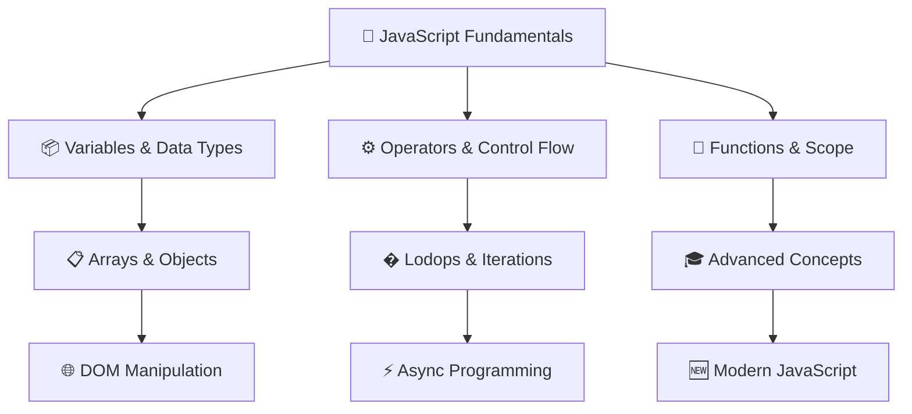
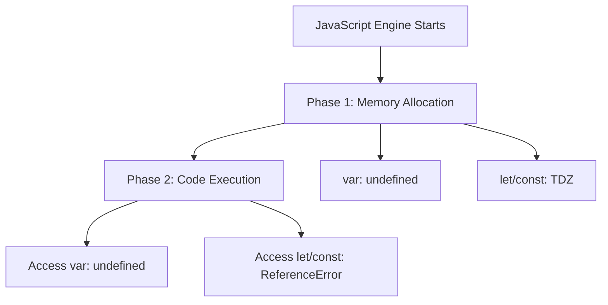
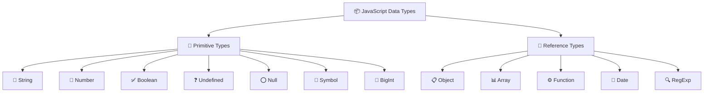
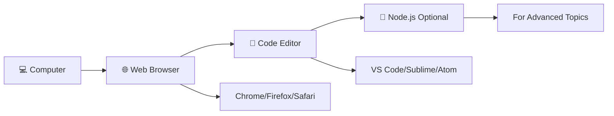

# 🚀 **JavaScript Complete Learning Guide**

<div align="center">


[](https://developer.mozilla.org/en-US/docs/Web/JavaScript)
[](LICENSE)
[](README.md)
[](https://github.com/Santoshpatel112/JAVASCRIPT-P1)

</div>

> 🎯 **Master JavaScript from Zero to Hero** - A comprehensive, interactive learning journey through modern JavaScript concepts with practical examples and hands-on exercises.

---

## � **Table of Contents**

- [🎯 Learning Objectives](#-learning-objectives)
- [🗺️ Learning Workflow](#️-learning-workflow)
- [📊 Key Facts & Statistics](#-key-facts--statistics)
- [📚 Course Modules](#-course-modules)
- [🛠️ Setup & Prerequisites](#️-setup--prerequisites)
- [🎮 Interactive Features](#-interactive-features)
- [📈 Progress Tracking](#-progress-tracking)

### 📚 **Detailed Chapter Index**

<details>
<summary>📖 <strong>Click to expand complete chapter navigation</strong></summary>

#### 🧠 **Chapter 1: Variables - The Foundation**

- [🔑 Key Concepts](#🔑-key-concepts)
- [📊 Quick Reference Table](#📊-quick-reference)
- [💡 Best Practice Decision Tree](#💡-best-practice-decision-tree)
- [🧪 var, let, and const Comparison](#🧪-var-let-and-const-comparison)
- [🔥 Scope Visualization](#🔥-scope-visualization)
- [🧨 Hoisting Behavior](#🧨-hoisting-behavior)
- [⚠️ Common Gotchas](#️-common-gotchas--reality-checks)
- [🧪 Interactive Practice Zone](#🧪-interactive-practice-zone)

#### 📦 **Chapter 2: Data Types + Type System**

- [📊 Type System Overview](#📊-type-system-overview)
- [🔹 Primitive Data Types](#🔹-primitive-data-types)
- [🔍 Understanding undefined vs null](#🔍-understanding-undefined-vs-null---the-complete-guide)
- [🔸 Reference Data Types](#🔸-reference-data-types)
- [🔍 typeof Operator](#🔍-typeof-operator)
- [🔁 Type Coercion](#🔁-type-coercion-auto-conversion)
- [🚨 Loose vs Strict Equality](#🚨-loose-vs-strict-equality)
- [🧪 NaN - Not a Number](#🧪-nan---not-a-number)
- [🔦 Truthy and Falsy Values](#🔦-truthy-and-falsy-values)
- [🧪 Interactive Practice Zone](#🧪-interactive-practice-zone-1)

#### ⚙️ **Chapter 3: Operators**

- [🔧 What are Operators?](#🔧-what-are-operators)
- [➕ Arithmetic Operators](#➕-arithmetic-operators)
- [🧮 Assignment Operators](#🧮-assignment-operators)
- [🧾 Comparison Operators](#🧾-comparison-operators)
- [✅ Logical Operators](#✅-logical-operators)
- [🌀 Unary Operators](#🌀-unary-operators)
- [❓ Ternary Operator](#❓-ternary-operator-conditional)
- [🧠 Developer Mindset](#🧠-developer-mindset)
- [❓ Common Confusions](#❓-common-confusions)
- [🧪 Interactive Practice Zone](#🧪-interactive-practice-zone-2)

#### 🧭 **Chapter 4: Control Flow**

- [🚦 What is Control Flow?](#🚦-what-is-control-flow)
- [🧱 if, else if, else](#🧱-if-else-if-else)
- [🌀 switch-case](#🌀-switch-case)
- [🔁 Early Return Pattern](#🔁-early-return-pattern)
- [⚠️ Common Confusions](#️-common-confusions-1)
- [🧠 Developer Mindset](#🧠-developer-mindset-1)
- [🧪 Interactive Practice Zone](#🧪-interactive-practice-zone-3)

#### 🔁 **Chapter 5: Loops**

- [🔄 Why Loops?](#🔄-why-loops)
- [🔁 for Loop](#🔁-for-loop)
- [🔁 while Loop](#🔁-while-loop)
- [🔁 do-while Loop](#🔁-do-while-loop)
- [⛔ break and continue](#⛔-break-and-continue)
- [🌀 for-of – Arrays & Strings](#🌀-for-of--arrays--strings)
- [🧱 forEach – Arrays](#🧱-foreach--arrays)
- [🧱 for-in – Objects](#🧱-for-in--objects)
- [🧠 Developer Mindset](#🧠-developer-mindset-2)

#### 🧮 **Chapter 6: Functions**

- [🧠 What are Functions?](#🧠-what-are-functions)
- [🛠️ Function Declarations](#️-function-declarations)
- [🧾 Parameters vs Arguments](#🧾-parameters-vs-arguments)
- [🌀 Return Values](#🌀-return-values)
- [🧰 Function Expressions](#🧰-function-expressions)
- [🏹 Arrow Functions](#🏹-arrow-functions)
- [🧂 Default + Rest + Spread](#🧂-default--rest--spread)
- [🔐 Closures & Lexical Scope](#🔐-closures--lexical-scope)

#### 🧰 **Chapter 7: Arrays**

- [🧠 What is an Array?](#🧠-what-is-an-array)
- [🛠️ Creating & Accessing Arrays](#️-creating--accessing-arrays)
- [⚙️ Common Array Methods](#️-common-array-methods)
- [🔄 Iteration Methods](#🔄-iteration-methods)
- [✂️ Destructuring & Spread](#️-destructuring--spread)

#### 🧱 **Chapter 8: Objects**

- [🧠 What is an Object?](#🧠-what-is-an-object)
- [🔑 Key-Value Structure](#🔑-key-value-structure)
- [📍 Dot vs Bracket Notation](#📍-dot-vs-bracket-notation)
- [🏗️ Nesting and Deep Access](#️-nesting-and-deep-access)
- [✂️ Object Destructuring](#️-object-destructuring)
- [🔁 Looping Through Objects](#🔁-looping-through-objects)
- [📦 Copying Objects](#📦-copying-objects)
- [❓ Optional Chaining](#❓-optional-chaining)
- [🧠 Computed Properties](#🧠-computed-properties)
- [🧠 Developer Mindset](#🧠-developer-mindset-3)

</details>

### 🎯 **Quick Jump Menu**

<div align="center">

| 📚 **Fundamentals**                                   | ⚙️ **Logic & Control**                     | 🔧 **Advanced**                      |
| ----------------------------------------------------- | ------------------------------------------ | ------------------------------------ |
| [Variables](#🧠-chapter-1-variables---the-foundation) | [Operators](#️-chapter-3-operators)        | [Functions](#🧮-chapter-6-functions) |
| [Data Types](#📦-chapter-2-data-types--type-system)   | [Control Flow](#🧭-chapter-4-control-flow) | [Arrays](#🧰-chapter-7-arrays)       |
|                                                       | [Loops](#🔁-chapter-5-loops)               | [Objects](#🧱-chapter-8-objects)     |

</div>

---

## 🎯 **Learning Objectives**



---

## 🗺️ **Learning Workflow**


---

## 📊 **Key Facts & Statistics**

<details>
<summary>📈 <strong>JavaScript Usage Statistics</strong></summary>

| 🏆 **Metric**             | 📊 **Value**        | 📚 **Source**         |
| ------------------------- | ------------------- | --------------------- |
| **Most Popular Language** | #1 for 11+ years    | Stack Overflow Survey |
| **GitHub Repositories**   | 19.3M+ repos        | GitHub Stats          |
| **Job Market Share**      | 65%+ of dev jobs    | Developer Survey      |
| **Learning Time**         | 3-6 months (basics) | Industry Average      |
| **Salary Range**          | $70k-$150k+         | PayScale 2024         |

</details>

<details>
<summary>🎯 <strong>Learning Path Metrics</strong></summary>

| � **Chapter**u | ⏱️ **Time** | 🌟 **Difficulty** | 🎮 **Exercises** |
| -------------- | ----------- | ----------------- | ---------------- |
| Variables      | 2-3 hours   | ⭐⭐              | 8 exercises      |
| Data Types     | 3-4 hours   | ⭐⭐⭐            | 10 exercises     |
| Operators      | 2-3 hours   | ⭐⭐              | 12 exercises     |
| Control Flow   | 4-5 hours   | ⭐⭐⭐            | 15 exercises     |
| Loops          | 3-4 hours   | ⭐⭐⭐            | 10 exercises     |
| Functions      | 5-6 hours   | ⭐⭐⭐⭐          | 18 exercises     |
| Arrays         | 4-5 hours   | ⭐⭐⭐            | 15 exercises     |
| Objects        | 4-5 hours   | ⭐⭐⭐⭐          | 12 exercises     |

</details>

---

## 📚 **Course Modules**

### 🧠 **Chapter 1: Variables - The Foundation**

<div align="center">


</div>

> **🎯 Goal**: Master variable declarations and understand scope concepts

**🔑 Key Concepts:**

- 📦 Variable containers and memory allocation
- � `evar`, `let`, `const` - when and why to use each
- 🚀 Hoisting behavior and Temporal Dead Zone (TDZ)
- 🏠 Block vs Function scope

**📊 Quick Reference:**

| 🏷️ **Declaration** | 🏠 **Scope** | 🔄 **Reassignable** | 🔁 **Redeclarable** | 🚀 **Hoisted** |
| ------------------ | ------------ | ------------------- | ------------------- | -------------- |
| `var`              | Function     | ✅                  | ✅                  | ✅ (undefined) |
| `let`              | Block        | ✅                  | ❌                  | ✅ (TDZ)       |
| `const`            | Block        | ❌                  | ❌                  | ✅ (TDZ)       |

**💡 Best Practice Decision Tree:**

```
🤔 Need a Variable?
    ↓
🔄 Will it change?
    ├─ No → ✅ Use const
    └─ Yes → 📦 Primitive or Object?
              ├─ Primitive → ✅ Use let
              └─ Object/Array → 📝 Contents change?
                                ├─ Yes → ✅ Use const
                                └─ No → ✅ Use let
```

**🧪 var, let, and const Comparison**

<table>
<tr>
<th>🧓 <strong>var - Old & Risky</strong></th>
<th>🆕 <strong>let - Modern & Safe</strong></th>
<th>🔐 <strong>const - Constant Values</strong></th>
</tr>
<tr>
<td>

```javascript
var score = 10;
var score = 20; // ✅ OK
```

- Function scoped
- Can redeclare & reassign
- Hoisted with `undefined`

</td>
<td>

```javascript
let age = 25;
age = 30; // ✅ OK
let age = 40; // ❌ Error
```

- Block scoped
- Can reassign, not redeclare
- Hoisted in TDZ

</td>
<td>

```javascript
const PI = 3.14;
PI = 3.14159; // ❌ Error
```

- Block scoped
- Cannot reassign/redeclare
- Must initialize at declaration

</td>
</tr>
</table>

**👉 Special Case - Objects & Arrays:**

```javascript
const student = { name: "Riya" };
student.name = "Priya"; // ✅ OK - modifying contents
student = {}; // ❌ Error - reassigning variable

const colors = ["red", "blue"];
colors.push("green"); // ✅ OK - modifying array
colors = []; // ❌ Error - reassigning variable
```

**🔥 Scope Visualization**

```
🌍 Global Scope
├── var globalVar
├── let globalLet
├── const globalConst
└── 🏠 Function Scope
    ├── var functionVar
    ├── let functionLet
    ├── const functionConst
    └── 📦 Block Scope {}
        ├── let blockLet
        ├── const blockConst
        └── var leaksOut ⚠️ (WARNING: escapes block!)
```

**📍 Scope Rules:**

- **Block Scope** → Code inside `{}` (loops, if statements, etc.)
- **Function Scope** → Code inside a function
- `let` and `const` follow **block scope**
- `var` ignores block scope → **leads to bugs**

```javascript
{
  var x = 5; // Function scoped
  let y = 10; // Block scoped
  const z = 15; // Block scoped
}
console.log(x); // ✅ 5 (accessible - leaked out!)
console.log(y); // ❌ ReferenceError
console.log(z); // ❌ ReferenceError
```

**🧨 Hoisting Behavior**



**Hoisting Examples:**

```javascript
// What you write:
console.log(a); // undefined (not error!)
var a = 10;

// What JavaScript sees:
var a; // hoisted to top
console.log(a); // undefined
a = 10;
```

```javascript
// Temporal Dead Zone (TDZ)
console.log(b); // ❌ ReferenceError
let b = 20;

console.log(c); // ❌ ReferenceError
const c = 30;
```

**⚠️ Common Gotchas & Reality Checks**

<details>
<summary>🚨 <strong>Click to reveal common mistakes</strong></summary>

| ❌ **Mistake**                     | ✅ **Reality**                                  | 💡 **Why**                           |
| ---------------------------------- | ----------------------------------------------- | ------------------------------------ |
| `const` makes everything immutable | `const` protects the variable binding           | Objects/arrays can still be modified |
| `var` is the same as `let`         | `var` has function scope, `let` has block scope | Different scoping rules              |
| Hoisting moves code physically     | Only declarations are hoisted, not assignments  | Memory allocation vs execution       |
| `let`/`const` aren't hoisted       | They are hoisted but in TDZ                     | Cannot access before declaration     |

</details>

**🧠 Developer Mindset Rules**

```javascript
// 🎯 The Golden Rule
const by_default = "Use const first";
let when_reassigning = "Use let when you need to change the value";
var never_use = "Avoid var - it belongs to the past";
```

**🧪 Interactive Practice Zone**

<details>
<summary>🎮 <strong>Exercise 1: Variable Declarations</strong></summary>

```javascript
// TODO: Declare your name and city using const, age using let
// Your code here:
```

<details>
<summary>💡 Solution</summary>

```javascript
const name = "John";
const city = "New York";
let age = 25;
```

</details>
</details>

<details>
<summary>🎮 <strong>Exercise 2: Spot the Error</strong></summary>

```javascript
let x = 5;
let x = 10; // What happens here?
```

<details>
<summary>💡 Answer</summary>

**Error:** `SyntaxError: Identifier 'x' has already been declared`
**Reason:** `let` cannot be redeclared in the same scope.

</details>
</details>

<details>
<summary>🎮 <strong>Exercise 3: Hoisting Challenge</strong></summary>

```javascript
console.log(count); // Guess the output
var count = 42;
```

<details>
<summary>💡 Answer</summary>

**Output:** `undefined`
**Reason:** `var` is hoisted but initialized with `undefined`.

</details>
</details>

---

### � **Chapter 2: Data Types + Type System**

<div align="center">


</div>

> **🎯 Goal**: Master JavaScript's type system and understand type coercion

**📊 Type System Overview:**



**🔹 Primitive Data Types**

| 🏷️ **Type** | 📝 **Description** | 💡 **Examples**                   |
| ----------- | ------------------ | --------------------------------- |
| **String**  | Text data          | `"hello"`, `'JavaScript'`         |
| **Number**  | Numeric values     | `42`, `-99`, `3.14`               |
| **Boolean** | True/false values  | `true`, `false`                   |
| **Symbol**  | Unique identifier  | `Symbol('id')`                    |
| **BigInt**  | Large integers     | `123456789012345678901234567890n` |

---

### 🔍 **Understanding `undefined` vs `null` - The Complete Guide**

Let me explain the difference clearly and simply, with examples.

#### ✅ **1️⃣ What is `undefined`?**

`undefined` means a variable has been **declared but never assigned a value**.
It happens **automatically** in JavaScript.

**Example:**

```javascript
let a;
console.log(a); // Output: undefined
```

👉 Here, `a` is declared but not assigned any value, so its value is `undefined`.

**Another Example:**

```javascript
function greet(name) {
  console.log(name);
}

greet(); // Output: undefined
```

👉 We didn't pass any argument, so `name` is `undefined`.

#### ✅ **2️⃣ What is `null`?**

`null` is something you assign **intentionally** to a variable to say:
👉 **"This variable should have no value."**

**Example:**

```javascript
let user = null;
console.log(user); // Output: null
```

This shows that we **intentionally** set `user` to have "no value".

#### ✅ **3️⃣ Key Differences:**

| 🏷️ **Feature**              | 🔹 **undefined**              | 🔸 **null**                      |
| --------------------------- | ----------------------------- | -------------------------------- |
| **Type**                    | `undefined`                   | `object`                         |
| **Assigned automatically?** | ✅ Yes                        | ❌ No (you set it)               |
| **Purpose**                 | Indicates "value not yet set" | Represents "no value" explicitly |
| **Example**                 | `let x;` → `x === undefined`  | `let x = null;` → `x === null`   |

#### ✅ **4️⃣ When to Use Which?**

- **Use `undefined`** when a variable is uninitialized by the system.
- **Use `null`** when you want to deliberately clear a variable or indicate "empty".

#### ✅ **5️⃣ Important Note:**

```javascript
console.log(typeof undefined); // "undefined"
console.log(typeof null); // "object" (this is a JavaScript quirk)
```

#### 🔥 **In Summary:**

- **`undefined`**: JavaScript sets it by default when a variable has no value.
- **`null`**: You explicitly assign it to indicate "empty" or "no value".

**🔸 Reference Data Types**

| 🏷️ **Type**  | 📝 **Description**   | 💡 **Examples**             |
| ------------ | -------------------- | --------------------------- |
| **Object**   | Key-value pairs      | `{ name: "John", age: 25 }` |
| **Array**    | Ordered list         | `[10, 20, 30]`              |
| **Function** | Reusable code blocks | `function greet() {}`       |

**🔍 typeof Operator**

```javascript
typeof "JavaScript"; // "string"
typeof 99; // "number"
typeof true; // "boolean"
typeof undefined; // "undefined"
typeof null; // "object" ← 🐛 known bug
typeof []; // "object"
typeof {}; // "object"
typeof function () {}; // "function"
```

**🔁 Type Coercion (Auto-Conversion)**

```javascript
"5" + 1; // "51" → number converted to string
"5" - 1; // 4 → string converted to number
true + 1; // 2
null + 1; // 1
undefined + 1; // NaN
```

**🚨 Loose vs Strict Equality**

```javascript
5 == "5"; // true  (loose - with type conversion)
5 === "5"; // false (strict - no conversion)
```

> 💡 **Always prefer `===` for accurate comparisons**

**🧪 NaN - Not a Number**

```javascript
typeof NaN; // "number" (confusing but true!)
```

Even though it means "Not a Number", `NaN` is actually of type `number`. This happens because operations like `0 / 0` or `parseInt("abc")` still produce a numeric result — just an invalid one.

**🔦 Truthy and Falsy Values**

**❌ Falsy values (only 6):**

- `false`
- `0`
- `""`
- `null`
- `undefined`
- `NaN`

**✅ Everything else is truthy, including:**

- `"0"` (non-empty string)
- `"false"` (non-empty string)
- `[]` (empty array)
- `{}` (empty object)
- `function(){}` (functions)

```javascript
if ("0") {
  console.log("Runs"); // "0" is a non-empty string = truthy
}
```

**🧪 Interactive Practice Zone**

<details>
<summary>🎮 <strong>Exercise 1: Type Prediction</strong></summary>

```javascript
console.log(null + 1); // ?
console.log("5" + 3); // ?
console.log("5" - 3); // ?
console.log(true + false); // ?
```

<details>
<summary>💡 Answer</summary>

```javascript
console.log(null + 1); // 1
console.log("5" + 3); // "53"
console.log("5" - 3); // 2
console.log(true + false); // 1
```

</details>
</details>

<details>
<summary>🎮 <strong>Exercise 2: Type Checking</strong></summary>

```javascript
console.log(typeof []); // ?
console.log(typeof null); // ?
console.log(typeof 123n); // ?
```

<details>
<summary>💡 Answer</summary>

```javascript
console.log(typeof []); // "object"
console.log(typeof null); // "object" (bug!)
console.log(typeof 123n); // "bigint"
```

</details>
</details>

---

### ⚙️ **Chapter 3: Operators**

<div align="center">


</div>

> **🎯 Goal**: Master JavaScript operators for calculations, comparisons, and logic

#### 🔧 **What are Operators?**

Operators are special symbols or keywords in JavaScript used to perform operations on values (operands).
You'll use them in calculations, comparisons, logic, assignments, and even type checks.
Think of them as the **verbs of your code** — they act on data.

#### ➕ **Arithmetic Operators**

Used for basic math operations:

| 🔢 **Operator** | 📝 **Description**     | 💡 **Example** |
| --------------- | ---------------------- | -------------- |
| `+`             | Addition               | `5 + 3 = 8`    |
| `-`             | Subtraction            | `5 - 3 = 2`    |
| `*`             | Multiplication         | `5 * 3 = 15`   |
| `/`             | Division               | `6 / 3 = 2`    |
| `%`             | Modulus (remainder)    | `5 % 3 = 2`    |
| `**`            | Exponentiation (power) | `2 ** 3 = 8`   |

**Example:**

```javascript
let a = 10,
  b = 3;
console.log(a + b); // 13
console.log(a % b); // 1
console.log(2 ** 3); // 8
```

#### 🧮 **Assignment Operators**

Assign values to variables:

| 🔧 **Operator**  | 📝 **Description**                 | 💡 **Example**         |
| ---------------- | ---------------------------------- | ---------------------- |
| `=`              | Assigns value                      | `x = 5`                |
| `+=`             | Add and assign                     | `x += 3` → `x = x + 3` |
| `-=`             | Subtract and assign                | `x -= 2` → `x = x - 2` |
| `*=`, `/=`, `%=` | Multiply/Divide/Modulus and assign | `x *= 2`               |

**Example:**

```javascript
let score = 5;
score += 2; // score = 7
```

#### 🧾 **Comparison Operators**

Used in condition checks:

| 🔍 **Operator**      | 📝 **Description** | 💡 **Example**        |
| -------------------- | ------------------ | --------------------- |
| `==`                 | Equal (loose)      | `5 == "5"` → `true`   |
| `===`                | Equal (strict)     | `5 === "5"` → `false` |
| `!=`                 | Not equal (loose)  | `5 != "6"` → `true`   |
| `!==`                | Not equal (strict) | `5 !== "5"` → `true`  |
| `>`, `<`, `>=`, `<=` | Greater/Less than  | `5 > 3` → `true`      |

**Example:**

```javascript
console.log(5 == "5"); // true
console.log(5 === "5"); // false
```

#### ✅ **Logical Operators**

Used to combine multiple conditions:

| 🧠 **Operator** | 📝 **Description**       | 💡 **Example**             |
| --------------- | ------------------------ | -------------------------- |
| `&&`            | AND - both must be true  | `true && false` → `false`  |
| `\|\|`          | OR - either one true     | `true \|\| false` → `true` |
| `!`             | NOT - negates truthiness | `!true` → `false`          |

**Example:**

```javascript
let age = 20,
  hasID = true;
if (age >= 18 && hasID) {
  console.log("Allowed");
}
```

#### 🌀 **Unary Operators**

Used on a single operand:

| 🔧 **Operator** | 📝 **Description** | 💡 **Example**            |
| --------------- | ------------------ | ------------------------- |
| `+`             | Convert to number  | `+"5"` → `5`              |
| `-`             | Negate             | `-5` → `-5`               |
| `++`            | Increment          | `x++` or `++x`            |
| `--`            | Decrement          | `x--` or `--x`            |
| `typeof`        | Returns data type  | `typeof 123` → `"number"` |

**Example:**

```javascript
let x = "5";
console.log(+x); // 5 (converted to number)
```

#### ❓ **Ternary Operator (Conditional)**

Shorthand for if...else:

```javascript
condition ? valueIfTrue : valueIfFalse;
```

**Example:**

```javascript
let score = 80;
let grade = score > 50 ? "Pass" : "Fail";
```

#### 🧠 **Developer Mindset**

Operators make logic happen. They help you make decisions, combine values, and create expressions.

**💡 Best Practices:**

- Use `===` instead of `==` to avoid type bugs
- Use ternary for quick decisions, not complex ones
- Think in truthy/falsy when using `&&`, `||`, `!`

#### ❓ **Common Confusions**

- `"5" + 1` is `"51"` (string concat), but `"5" - 1` is `4` (number subtract)
- `!!value` is a quick trick to convert anything into a boolean
- Pre-increment (`++i`) vs post-increment (`i++`) return different results

#### 🧪 **Interactive Practice Zone**

<details>
<summary>🎮 <strong>Exercise 1: Predict the Output</strong></summary>

```javascript
console.log("10" + 1); // ?
console.log("10" - 1); // ?
console.log(true + false); // ?
console.log(!!"JavaScript"); // ?
```

<details>
<summary>💡 Answer</summary>

```javascript
console.log("10" + 1); // "101"
console.log("10" - 1); // 9
console.log(true + false); // 1
console.log(!!"JavaScript"); // true
```

</details>
</details>

<details>
<summary>🎮 <strong>Exercise 2: Ternary Practice</strong></summary>

```javascript
let age = 17;
let msg = age >= 18 ? "Adult" : "Minor";
console.log(msg); // ?
```

<details>
<summary>💡 Answer</summary>

```javascript
console.log(msg); // "Minor"
```

</details>
</details>

---

### 🧭 **Chapter 4: Control Flow**

<div align="center">


</div>

> **🎯 Goal**: Master conditional statements and program flow control

#### 🚦 **What is Control Flow?**

Control flow decides **which code runs**, **when it runs**, and **how many times it runs**.
It's like decision-making + direction in your JavaScript program.
If operators are the verbs, control flow is the **traffic signal**.

#### 🧱 **if, else if, else**

```javascript
if (condition) {
  // runs if condition is true
} else if (anotherCondition) {
  // runs if first was false, second is true
} else {
  // runs if none are true
}
```

**✅ Example:**

```javascript
let marks = 78;
if (marks >= 90) {
  console.log("A");
} else if (marks >= 75) {
  console.log("B");
} else {
  console.log("C");
}
```

#### 🌀 **switch-case**

Great for checking one variable against many values:

```javascript
switch (value) {
  case value1:
    // code
    break;
  case value2:
    // code
    break;
  default:
  // fallback
}
```

**✅ Example:**

```javascript
let fruit = "apple";
switch (fruit) {
  case "banana":
    console.log("Yellow");
    break;
  case "apple":
    console.log("Red");
    break;
  default:
    console.log("Unknown");
}
```

#### 🔁 **Early Return Pattern**

Used in functions to exit early if some condition fails:

```javascript
function checkAge(age) {
  if (age < 18) return "Denied";
  return "Allowed";
}
```

This avoids deep nesting and makes logic cleaner.

#### ⚠️ **Common Confusions**

- `switch-case` executes all cases after a match unless you `break`
- `else if` chain works top-down — order matters
- You can use truthy/falsy values directly in `if`

#### 🧠 **Developer Mindset**

Control flow = **conditional storytelling**.
It helps your program make choices and respond differently to different inputs.
Write readable branches. Avoid nesting too deep — use early return if needed.

#### 🧪 **Interactive Practice Zone**

<details>
<summary>🎮 <strong>Exercise 1: Grade Calculator</strong></summary>

```javascript
// Write a program that prints A, B, C, D, or F based on marks
let marks = 85;
// Your code here:
```

<details>
<summary>💡 Solution</summary>

```javascript
if (marks >= 90) {
  console.log("A");
} else if (marks >= 80) {
  console.log("B");
} else if (marks >= 70) {
  console.log("C");
} else if (marks >= 60) {
  console.log("D");
} else {
  console.log("F");
}
```

</details>
</details>

---

### 🔁 **Chapter 5: Loops**

<div align="center">


</div>

> **🎯 Goal**: Master iteration and repetitive tasks in JavaScript

#### 🔄 **Why Loops?**

Loops help us repeat code without rewriting it.
If a task needs to be done multiple times (e.g., printing 1–10, going through an array, or checking each character in a string), loops are the **backbone**.

#### 🔁 **for Loop**

```javascript
for (let i = 0; i < 5; i++) {
  console.log(i);
}
```

- Start from `i = 0`
- Run till `i < 5`
- Increase `i` each time

#### 🔁 **while Loop**

```javascript
let i = 0;
while (i < 5) {
  console.log(i);
  i++;
}
```

Condition is checked **before** running.

#### 🔁 **do-while Loop**

```javascript
let i = 0;
do {
  console.log(i);
  i++;
} while (i < 5);
```

Runs **at least once**, even if condition is false.

#### ⛔ **break and continue**

- **`break`**: Exit loop completely
- **`continue`**: Skip current iteration and move to next

```javascript
for (let i = 1; i <= 5; i++) {
  if (i === 3) continue;
  console.log(i); // Skips 3
}
```

#### 🌀 **for-of – Arrays & Strings**

Works on anything iterable (arrays, strings):

```javascript
for (let char of "JavaScript") {
  console.log(char);
}
```

#### 🧱 **forEach – Arrays**

Cleaner than `for` for arrays, but you can't `break`/`return`:

```javascript
let nums = [10, 20, 30];
nums.forEach((num) => {
  console.log(num);
});
```

#### 🧱 **for-in – Objects**

Goes over keys in objects:

```javascript
let user = { name: "John", age: 26 };
for (let key in user) {
  console.log(key, user[key]);
}
```

#### 🧠 **Developer Mindset**

Loops = **data processor**.
Use the right loop for the job:

- **`for`** = best for numbers/indexes
- **`for-of`** = for array values
- **`for-in`** = for object keys
- **`while`** = for unpredictable conditions

---

### 🧮 **Chapter 6: Functions**

<div align="center">


</div>

> **🎯 Goal**: Master function creation, parameters, and advanced concepts

#### 🧠 **What are Functions?**

Functions are **blocks of reusable logic**.
Instead of repeating the same task again and again, wrap it in a function and reuse it with different inputs.

Think of a function like a **vending machine**:

- **Input**: you give money + item code
- **Output**: it gives you the item
- **Logic**: hidden inside

#### 🛠️ **Function Declarations**

```javascript
function greet() {
  console.log("Welcome to JavaScript!");
}
greet();
```

You define it once, then call it whenever needed.

#### 🧾 **Parameters vs Arguments**

```javascript
function greet(name) {
  // 'name' is a parameter
  console.log("Hello " + name);
}
greet("John"); // "John" is the argument you pass
```

#### 🌀 **Return Values**

```javascript
function sum(a, b) {
  return a + b;
}
let total = sum(5, 10); // total is 15
```

- `return` sends back a result to wherever the function was called
- After `return`, function exits

#### 🧰 **Function Expressions**

```javascript
const greet = function () {
  console.log("Hello!");
};
```

Functions stored in variables. Cannot be hoisted (you can't call them before they're defined).

#### 🏹 **Arrow Functions**

```javascript
const greet = () => {
  console.log("Hi!");
};
```

- Cleaner syntax
- No own `this`, no `arguments` object

#### 🧂 **Default + Rest + Spread**

```javascript
function multiply(a = 1, b = 1) {
  // Default parameters
  return a * b;
}

function sum(...nums) {
  // Rest parameter
  return nums.reduce((acc, val) => acc + val, 0);
}

let nums = [1, 2, 3];
console.log(sum(...nums)); // Spread operator
```

#### 🔐 **Closures & Lexical Scope**

Closures = when a function remembers its parent scope, even after the parent has finished.

```javascript
function outer() {
  let count = 0;
  return function () {
    count++;
    console.log(count);
  };
}
let counter = outer();
counter(); // 1
counter(); // 2
```

Even after `outer` is done, `counter` still remembers `count`.

---

### 🧰 **Chapter 7: Arrays**

<div align="center">


</div>

> **🎯 Goal**: Master array manipulation and iteration methods

#### 🧠 **What is an Array?**

An array is like a **row of boxes**, where each box holds a value and has an index (0, 1, 2...).
Arrays help you store multiple values in a single variable — numbers, strings, or even objects/functions.

#### 🛠️ **Creating & Accessing Arrays**

```javascript
let fruits = ["apple", "banana", "mango"];

let marks = [90, 85, 78];
console.log(marks[1]); // 85
marks[2] = 80; // Update index 2
```

- Indexing starts from **0**
- You can access, update, or overwrite values by index

#### ⚙️ **Common Array Methods**

**🧱 Modifiers (Change original array):**

```javascript
let arr = [1, 2, 3, 4];
arr.push(5); // Add to end
arr.pop(); // Remove last
arr.shift(); // Remove first
arr.unshift(0); // Add to start
arr.splice(1, 2); // Remove 2 items starting at index 1
arr.reverse(); // Reverse order
```

**🔍 Extractors (Don't modify original array):**

```javascript
let newArr = arr.slice(1, 3); // Copy from index 1 to 2
arr.sort(); // Lexical sort by default
```

#### 🔄 **Iteration Methods**

**`map()`** - Returns a new array with modified values:

```javascript
let prices = [100, 200, 300];
let taxed = prices.map((p) => p * 1.18);
```

**`filter()`** - Filters out elements based on a condition:

```javascript
let nums = [1, 2, 3, 4];
let even = nums.filter((n) => n % 2 === 0);
```

**`reduce()`** - Reduces the array to a single value:

```javascript
let total = nums.reduce((acc, val) => acc + val, 0);
```

**`forEach()`** - Performs an action for each element:

```javascript
nums.forEach((n) => console.log(n));
```

#### ✂️ **Destructuring & Spread**

```javascript
let [first, second] = ["a", "b", "c"];
let newArr = [...nums, 99]; // Spread to copy & add
```

---

### 🧱 **Chapter 8: Objects**

<div align="center">


</div>

> **🎯 Goal**: Master object creation, manipulation, and advanced patterns

#### 🧠 **What is an Object?**

Objects in JavaScript are like **real-world records** – a collection of key-value pairs.
They help us store structured data (like a student, a product, or a user profile).

#### 🔑 **Key-Value Structure**

```javascript
let student = {
  name: "Ravi",
  age: 21,
  isEnrolled: true,
};

console.log(student["name"]); // Ravi
console.log(student.age); // 21
```

- Keys are always strings (even if you write them as numbers or identifiers)
- Values can be anything – string, number, array, object, function, etc.

#### 📍 **Dot vs Bracket Notation**

```javascript
student["full name"] = "Ravi Kumar"; // ✅ Use bracket for multi-word keys
student.course = "JavaScript"; // ✅ Use dot for simple keys
```

#### 🏗️ **Nesting and Deep Access**

```javascript
let user = {
  name: "Amit",
  address: {
    city: "Delhi",
    pincode: 110001,
  },
};
console.log(user.address.city); // Delhi
```

#### ✂️ **Object Destructuring**

```javascript
let { name, age } = student;

// For nested objects:
let {
  address: { city },
} = user;
```

#### 🔁 **Looping Through Objects**

```javascript
for (let key in student) {
  console.log(key, student[key]);
}

Object.keys(student); // ["name", "age", "isEnrolled"]
Object.entries(student); // [["name", "Ravi"], ["age", 21], ...]
```

#### 📦 **Copying Objects**

**Shallow Copy (one level deep):**

```javascript
let newStudent = { ...student };
let newOne = Object.assign({}, student);
```

**Deep Copy (nested levels):**

```javascript
let deepCopy = JSON.parse(JSON.stringify(user));
```

#### ❓ **Optional Chaining**

```javascript
console.log(user?.address?.city); // Delhi
console.log(user?.profile?.email); // undefined (no error)
```

#### 🧠 **Computed Properties**

```javascript
let key = "marks";
let report = {
  [key]: 89,
};
```

#### 🧠 **Developer Mindset**

Objects are **structured state** – perfect for modeling anything complex: a user, a form, a product, etc.
Use destructuring, chaining, and dynamic keys wisely.

---

## 🛠️ **Setup & Prerequisites**

### 📋 **What You Need**



### 🚀 **Quick Start**

1. **📥 Clone this repository:**

   ```bash
   git clone https://github.com/Santoshpatel112/JAVASCRIPT-P1.git
   cd JAVASCRIPT-P1
   ```

2. **🌐 Open in your browser:**

   ```bash
   # Open index.html in your browser
   # Or use Live Server extension in VS Code
   ```

3. **📚 Start learning:**
   - Read each chapter in order
   - Practice with the provided exercises
   - Check your understanding with quizzes

### 🎮 **Interactive Features**

<details>
<summary>🔧 <strong>Built-in Tools</strong></summary>

- **📝 Code Playground**: Interactive code examples you can modify
- **🧪 Practice Exercises**: Hands-on coding challenges
- **📊 Progress Tracking**: Visual progress indicators
- **🎯 Quizzes**: Knowledge check points
- **💡 Hints & Solutions**: Step-by-step guidance
- **📚 Reference Cards**: Quick lookup tables

</details>

### 📈 **Progress Tracking**

Track your learning journey:

- [ ] **Chapter 1**: Variables ⭐⭐
- [ ] **Chapter 2**: Data Types ⭐⭐⭐
- [ ] **Chapter 3**: Operators ⭐⭐
- [ ] **Chapter 4**: Control Flow ⭐⭐⭐
- [ ] **Chapter 5**: Loops ⭐⭐⭐
- [ ] **Chapter 6**: Functions ⭐⭐⭐⭐
- [ ] **Chapter 7**: Arrays ⭐⭐⭐
- [ ] **Chapter 8**: Objects ⭐⭐⭐⭐

**Legend:** ⭐ = Difficulty Level

---

## 🤝 **Contributing**

Found an error or want to improve something?

1. 🍴 Fork the repository
2. 🌿 Create a feature branch
3. ✏️ Make your changes
4. 📤 Submit a pull request

---

## 📞 **Support & Community**

- 🐛 **Issues**: [Report bugs here](https://github.com/Santoshpatel112/JAVASCRIPT-P1/issues)
- 💬 **Discussions**: [Join the community](https://github.com/Santoshpatel112/JAVASCRIPT-P1/discussions)
- 📧 **Contact**: [Your Email](mailto:your.email@example.com)

---

## 📄 **License**

This project is licensed under the MIT License - see the [LICENSE](LICENSE) file for details.

---

<div align="center">

**🎉 Happy Learning! 🎉**

_Made with ❤️ for JavaScript learners everywhere_

[](https://github.com/Santoshpatel112/JAVASCRIPT-P1)
[](https://github.com/Santoshpatel112/JAVASCRIPT-P1/fork)
[](https://github.com/Santoshpatel112)


**🚀 Keep Coding, Keep Learning! 🚀**

</div>
